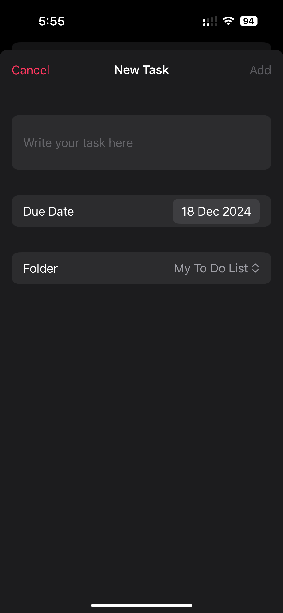

# Things To Do

**Things To Do** is a minimalistic task management and journaling app built with SwiftUI. Designed with simplicity, accessibility, and a native Apple-inspired aesthetic, this app helps users stay organized and reflect on their daily progress.

---

## Features

### 1. **SwiftData Integration**
- Uses Apple's **SwiftData** for seamless data persistence.
- Automatically saves tasks, folders, and journal entries, ensuring no progress is lost.

### 2. **Daily Notifications**
- Receive reminders to:
  - Check and complete your tasks.
  - Log your day in the journal.
- Notifications are customizable and ensure you stay on track with your goals.

### 3. **VoiceOver Accessibility**
- Full support for **VoiceOver** to ensure a seamless experience for visually impaired users.
- Dynamic accessibility labels and hints make navigation and interaction intuitive.

### 4. **Color Accessibility**
- Designed with **color accessibility** in mind using only native Apple colors.
- Supports **Dynamic Type** and **high contrast modes** to cater to a wide range of users.

### 5. **Native Apple Design**
- Implements a clean and modern UI inspired by Apple's design principles.
- Utilizes **SF Symbols**, **native components**, and **animations** for a polished look.

---

## Screenshots

### Home Screen

### Calendar View

### Journal Log

---

## Technologies Used

- **SwiftUI**
- **SwiftData**
- **UserNotifications Framework**
- **VoiceOver & Accessibility Frameworks**

---

## Future Enhancements

1. **Widgets**
   - Add widgets for quick task overviews and journal prompts.

2. **Live Activities**
   - Real-time task progress tracking on the lock screen.

3. **More Personalized**
   - Add more icons, colors and other personalized features.

4. **Language Settings**
   - Langua settings to include more communities around the world.

---

## License

This project is licensed under the [MIT License](LICENSE).

---

Thank you for checking out **Things To Do**! I hope it helps you stay organized and mindful every day. ♥︎

